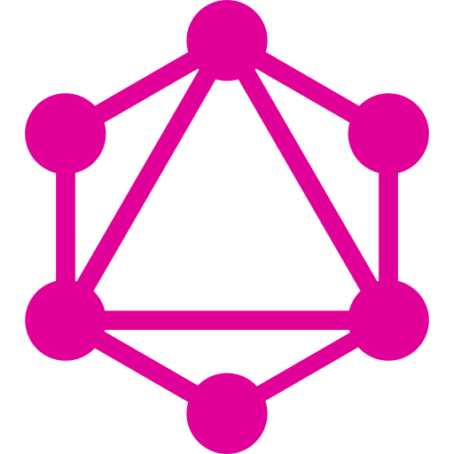

# Coding Challenge

# Deployed Application
 - ### [Coding Challenge](https://ommo-challenge-zja.herokuapp.com/)

# How to run on local computer

First you must go into you main folder of your project and run:
```
npm install
```

If this does not work then go into the individual client and server folders and run the following code while in both folder directories:
```
npm install
```

Next, while still in the main folder, you need to build an optimized version of your from end so run:
```
npm run build
```

Next, while still in the main folder, you need to seed your local database so run:
```
npm run seed
```

Lastly, while still in the main folder, you can start your application:
```
npm run develop
```


# Notice

The deployed application does not have 10,000/100,000 data sets per each sensor. The heroku server could not hold up that large amount of data seeding. The deployed application is a quick and easy way to play around with the application and also show how the application works when not on a local computer.

# Technologies

<a href="https://reactjs.org/" target="_blank"></a>
<a href="https://www.mongodb.com/" target="_blank"></a>
<a href="https://www.javascript.com/" target="_blank"></a>
<a href="https://nodejs.org/en/" target="_blank"></a>
<a href="https://html.com/" target="_blank"></a>
<a href="https://www.w3.org/Style/CSS/Overview.en.html" target="_blank"></a>
<a href="https://expressjs.com/" target="_blank" style="font-size: 6rem;"></a>
<a href="https://www.apollographql.com/" target="_blank" style="font-size: 6rem;"></a>
<a href="https://graphql.org/" target="_blank" style="font-size: 6rem;"></a>
